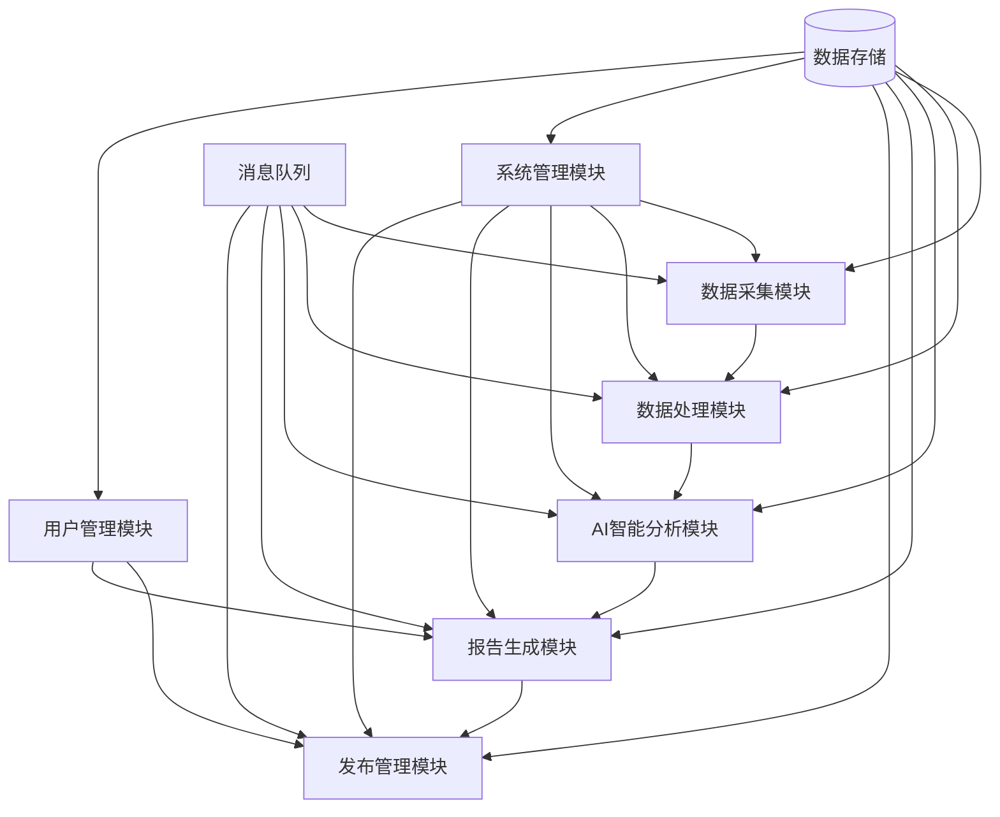

# 模块间接口交互说明

## 接口交互流程图



## 核心数据流

### 1. 新闻采集处理流程
```
数据采集模块 → 原始数据 → 数据处理模块 → 清洗数据 → AI分析模块 → 分析结果 → 报告生成模块 → 生成报告 → 发布管理模块
```

### 2. 用户订阅流程
```
用户管理模块 → 用户偏好 → 报告生成模块 → 个性化报告 → 发布管理模块 → 推送通知
```

### 3. 系统监控流程
```
各业务模块 → 监控指标 → 系统管理模块 → 告警规则 → 通知服务
```

## 主要接口定义

### 1. 数据流接口

#### 数据采集 → 数据处理
```python
def push_collected_data(data: CollectedData) -> bool:
    """推送采集的原始数据"""
    pass
```

#### 数据处理 → AI分析
```python
def send_processed_content(content: ProcessedContent) -> bool:
    """发送处理后的内容进行AI分析"""
    pass
```

#### AI分析 → 报告生成
```python
def provide_analysis_results(results: AnalysisResult) -> bool:
    """提供分析结果用于报告生成"""
    pass
```

#### 报告生成 → 发布管理
```python
def submit_report_for_publishing(report: GeneratedReport) -> bool:
    """提交报告进行发布"""
    pass
```

### 2. 管理接口

#### 系统管理接口
```python
# 配置管理
def get_module_config(module_name: str) -> ModuleConfig:
    """获取模块配置"""
    pass

def update_module_config(module_name: str, config: ModuleConfig) -> bool:
    """更新模块配置"""
    pass

# 任务调度
def schedule_module_task(module_name: str, task: TaskDefinition) -> str:
    """为模块调度任务"""
    pass

# 健康监控
def report_module_health(module_name: str, health: HealthStatus) -> bool:
    """报告模块健康状态"""
    pass
```

#### 用户管理接口
```python
def get_user_preferences(user_id: str) -> UserPreferences:
    """获取用户偏好设置"""
    pass

def get_subscription_settings(user_id: str) -> SubscriptionSettings:
    """获取用户订阅设置"""
    pass
```

### 3. 存储接口

#### 通用存储接口
```python
def store_data(data_type: str, data: Any) -> str:
    """存储数据并返回ID"""
    pass

def retrieve_data(data_type: str, data_id: str) -> Any:
    """根据ID检索数据"""
    pass

def query_data(data_type: str, query: QueryCriteria) -> List[Any]:
    """根据条件查询数据"""
    pass

def update_data(data_type: str, data_id: str, updates: dict) -> bool:
    """更新数据"""
    pass

def delete_data(data_type: str, data_id: str) -> bool:
    """删除数据"""
    pass
```

## 消息队列主题

### 1. 数据流主题
```yaml
topics:
  - name: "raw_data_collected"
    description: "原始数据采集完成"
    producer: "数据采集模块"
    consumers: ["数据处理模块"]
  
  - name: "data_processed"
    description: "数据处理完成"
    producer: "数据处理模块"
    consumers: ["AI分析模块"]
  
  - name: "analysis_completed"
    description: "AI分析完成"
    producer: "AI分析模块"
    consumers: ["报告生成模块"]
  
  - name: "report_generated"
    description: "报告生成完成"
    producer: "报告生成模块"
    consumers: ["发布管理模块"]
  
  - name: "content_published"
    description: "内容发布完成"
    producer: "发布管理模块"
    consumers: ["系统管理模块", "用户管理模块"]
```

### 2. 系统管理主题
```yaml
management_topics:
  - name: "config_updated"
    description: "配置更新通知"
    producer: "系统管理模块"
    consumers: ["所有业务模块"]
  
  - name: "task_scheduled"
    description: "任务调度通知"
    producer: "系统管理模块"
    consumers: ["相关业务模块"]
  
  - name: "alert_triggered"
    description: "告警触发通知"
    producer: "系统管理模块"
    consumers: ["通知服务"]
  
  - name: "health_check_result"
    description: "健康检查结果"
    producer: "各业务模块"
    consumers: ["系统管理模块"]
```

## 错误处理和重试机制

### 1. 接口调用错误处理
```python
class InterfaceError(Exception):
    """接口调用错误基类"""
    pass

class NetworkError(InterfaceError):
    """网络连接错误"""
    pass

class ValidationError(InterfaceError):
    """数据验证错误"""
    pass

class ServiceUnavailableError(InterfaceError):
    """服务不可用错误"""
    pass

def with_retry(max_retries=3, backoff_factor=2):
    """重试装饰器"""
    def decorator(func):
        def wrapper(*args, **kwargs):
            for attempt in range(max_retries):
                try:
                    return func(*args, **kwargs)
                except (NetworkError, ServiceUnavailableError) as e:
                    if attempt == max_retries - 1:
                        raise
                    time.sleep(backoff_factor ** attempt)
            return None
        return wrapper
    return decorator
```

### 2. 消息队列错误处理
```yaml
message_queue_config:
  retry_policy:
    max_retries: 3
    initial_interval: 1s
    max_interval: 30s
    multiplier: 2.0
  
  dead_letter_queue:
    enabled: true
    max_delivery_attempts: 5
  
  acknowledgment:
    mode: "manual"
    timeout: 30s
```

## 性能优化策略

### 1. 异步处理
- 使用异步IO提高并发性能
- 消息队列解耦模块间依赖
- 批处理减少接口调用次数

### 2. 缓存策略
- Redis缓存热点数据
- 本地缓存减少网络调用
- 缓存预热和过期策略

### 3. 负载均衡
- 模块实例水平扩展
- 请求分发均衡
- 熔断器防止级联故障

### 4. 数据分片
- 按时间分片存储历史数据
- 按来源分片存储采集数据
- 读写分离优化查询性能

## 安全性考虑

### 1. 接口认证
```python
def authenticate_request(request: Request) -> bool:
    """验证请求身份"""
    token = request.headers.get('Authorization')
    return validate_jwt_token(token)

def authorize_operation(user_id: str, resource: str, action: str) -> bool:
    """授权操作权限"""
    return check_user_permission(user_id, resource, action)
```

### 2. 数据加密
- 敏感数据传输加密
- 数据库敏感字段加密
- API密钥安全存储

### 3. 访问控制
- 基于角色的权限控制
- API访问频率限制
- 敏感操作审计日志

## 接口版本管理

### 1. 版本策略
```python
API_VERSION = "v1"
COMPATIBLE_VERSIONS = ["v1.0", "v1.1", "v1.2"]

def check_api_compatibility(client_version: str) -> bool:
    """检查API版本兼容性"""
    return client_version in COMPATIBLE_VERSIONS
```

### 2. 向后兼容
- 新增字段保持可选
- 废弃字段渐进式移除
- 版本过渡期支持多版本

### 3. 变更通知
- API变更提前通知
- 变更文档自动生成
- 版本升级指南提供 